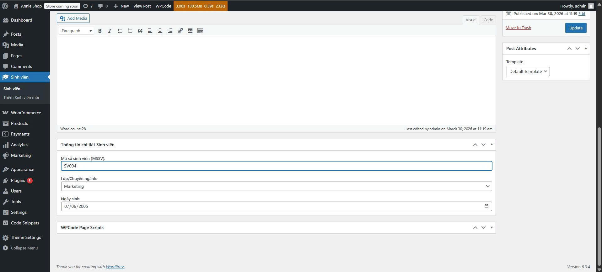
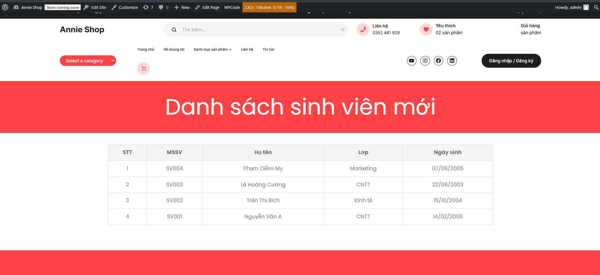

# Student Manager Plugin

Bài tập thực hành viết Plugin WordPress quản lý sinh viên.

## 1. Yêu cầu chức năng đã hoàn thành
### A. Quản trị hệ thống (Backend)
- **Custom Post Type**: Đã tạo mục "Sinh viên" trong menu WordPress.
- **Thuộc tính hỗ trợ**: Hỗ trợ nhập Họ tên (Title) và Tiểu sử/Ghi chú (Editor).
- **Custom Meta Boxes**: Thêm khu vực nhập liệu bổ sung gồm:
  - Mã số sinh viên (MSSV): Kiểu text.
  - Lớp/Chuyên ngành: Dropdown (CNTT, Kinh tế, Marketing).
  - Ngày sinh: Kiểu date.
- **Bảo mật**: Sử dụng Nonce để bảo mật và Sanitize dữ liệu trước khi lưu vào database.

### B. Hiển thị dữ liệu (Frontend)
- **Shortcode**: Tạo mã `[danh_sach_sinh_vien]`.
- **Logic hiển thị**: Truy vấn toàn bộ sinh viên và hiển thị dưới dạng bảng HTML gồm các cột: STT, MSSV, Họ tên, Lớp, Ngày sinh.

---

## 2. Ảnh chụp kết quả

### Giao diện Quản trị (Backend)
Đây là khu vực nhập liệu chi tiết thông tin sinh viên với các Custom Meta Box:


### Giao diện Hiển thị (Frontend)
Danh sách sinh viên được hiển thị ra ngoài trang web thông qua Shortcode:


---

## 3. Cấu trúc thư mục Plugin
```text
student-manager/
├── student-manager.php (File chính)
├── includes/
│   ├── cpt-metabox.php (Xử lý CPT & Meta Box)
│   └── shortcode.php   (Xử lý hiển thị Shortcode)
└── assets/
    └── style.css       (CSS cho bảng hiển thị)
